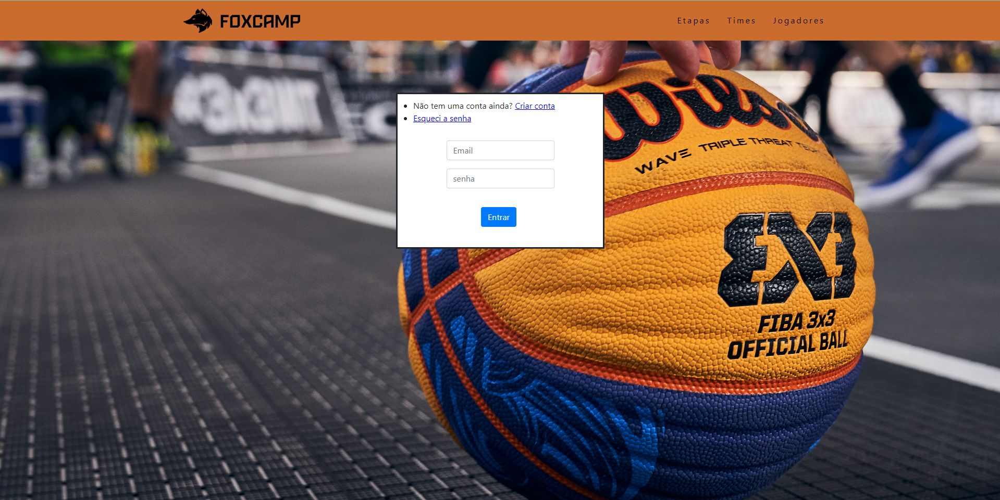
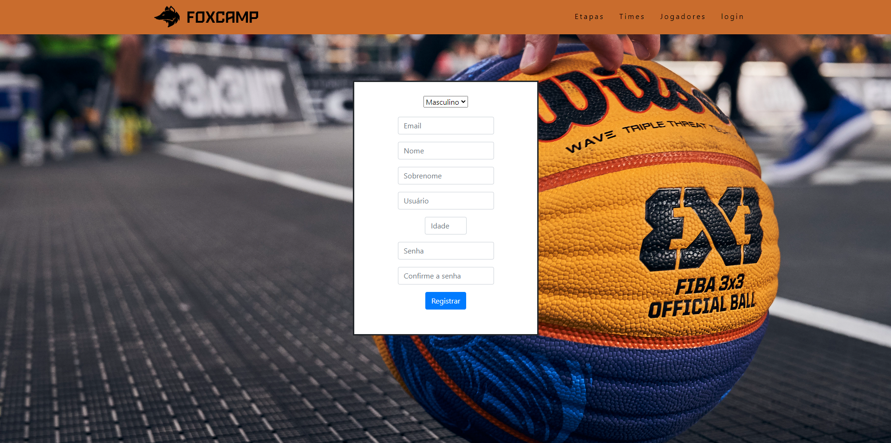
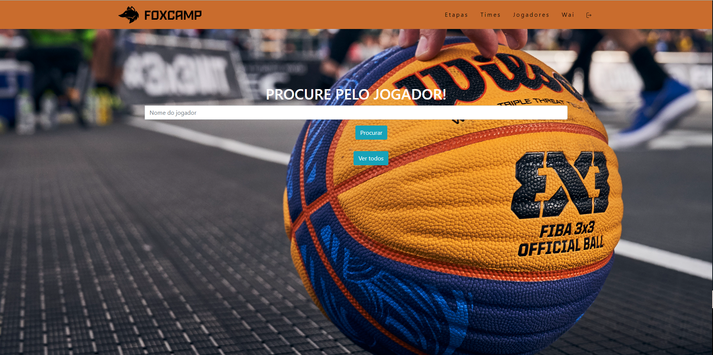
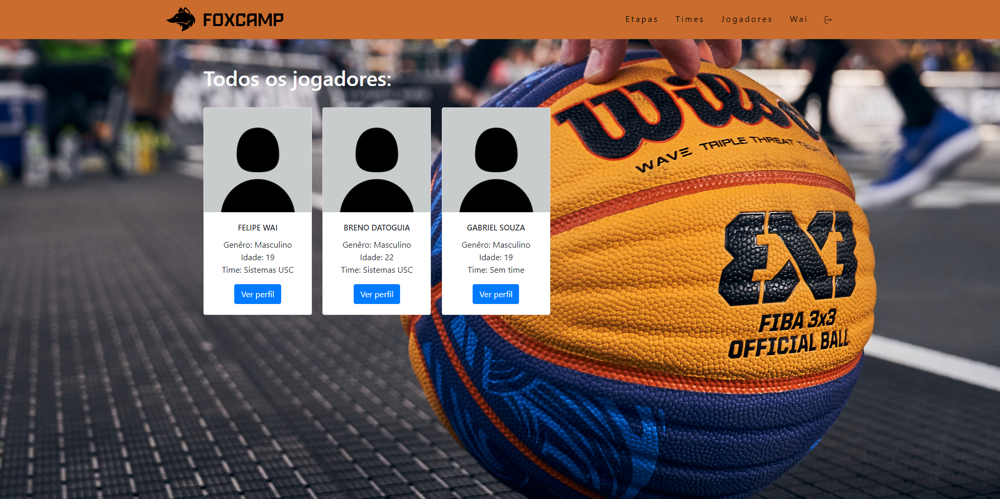
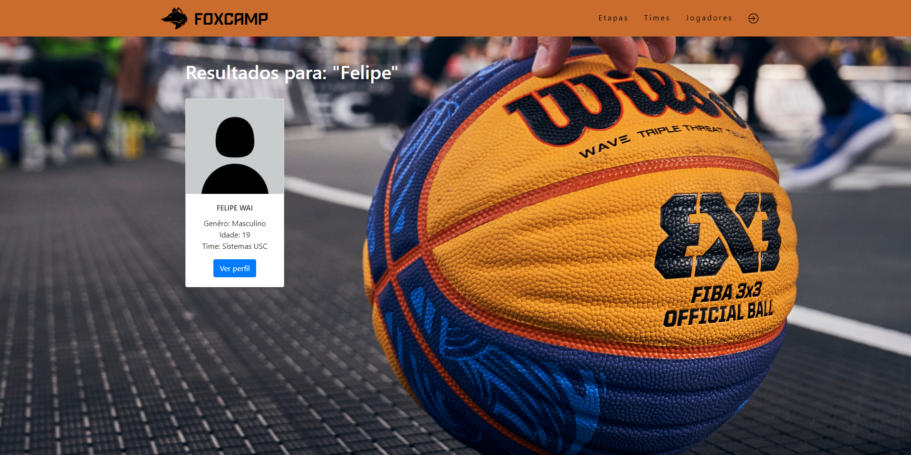
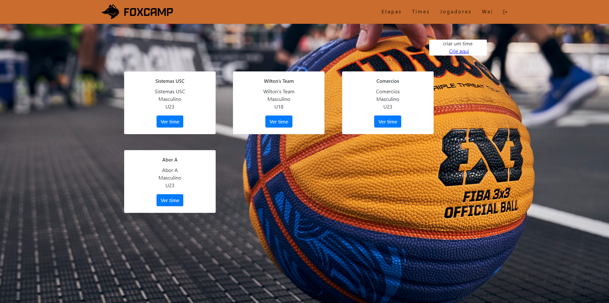
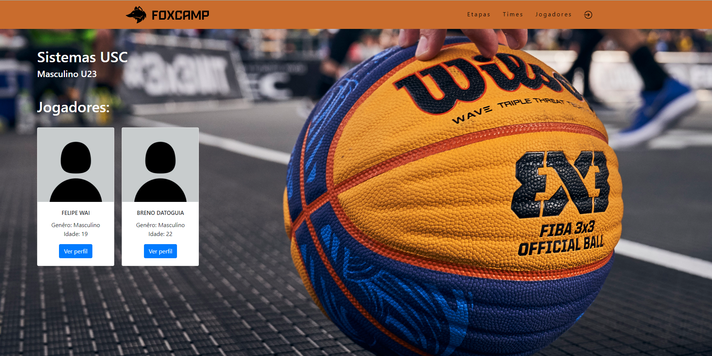
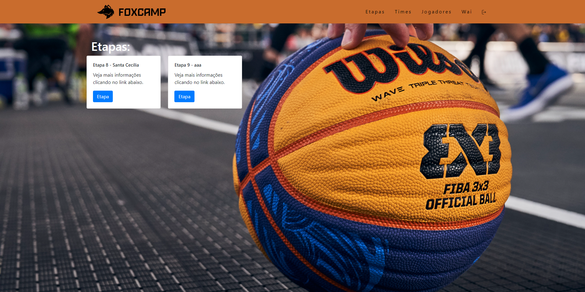
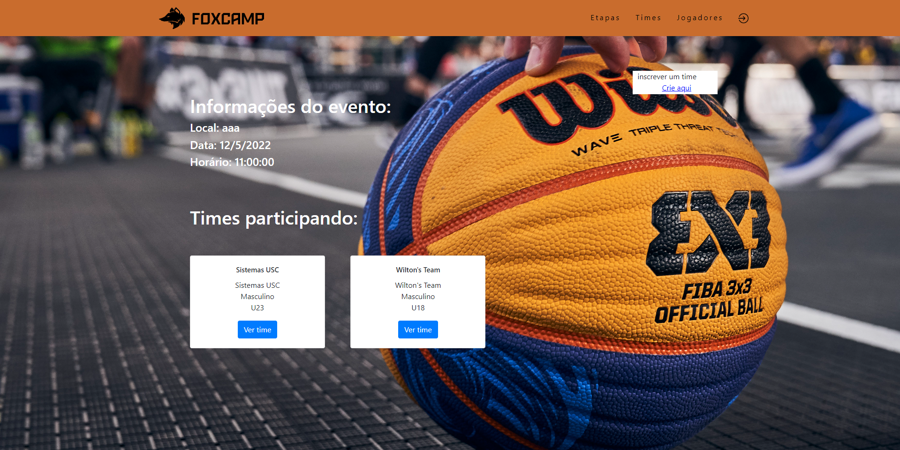
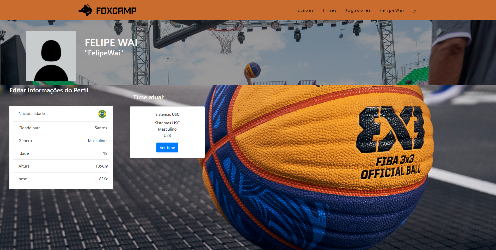

# **Foxcamp Web application**
>This is my web application for the CS50 final project

<br>

# **Features**

- Flask
- Flask WTF
- Flask Mysqldb
- Werkzeug Security
#### Since I've used flask as my framework I choosed flask mysqldb to manage the mysql databsase and flask wtf for the forms and also used werkzeug security for the passwords
<br>


# **Project description**

#### This final project is a website for a local basketball championship where the players can register, create teams, subscribe their teams to the championship phases and get all the information they need

<br>

#### All the information is stored in a local mysql database called "foxcampdb" connected by the flask-mysqldb
<br>

## Mysql Database

#### I used 5 tables for this project

- First  is the players table where their  id, name, last name, username, email, gender, age, team and password are stored

- Second is the teams table where their id, name, gender, category, and creator_id (used to reference to a player id and check if the person that's logged is the owner and can add players to the team or subscribe to a phase) are stored

- Third is the phases table where their id, local, date, time and active (way I found to turn the subscriptions "on and off" for the teams) are stored

- Fourth is the phases_teams where all the six teams that will participate at the phase and the id of the phase will be stored

- Fifth is the phase_result where the admin can store the first, second and third place of the phase
<br>
<br>

## **Registration and Login code**

### **Register code**
```
@app.route("/register", methods=['POST', 'GET'])
def register():
    nome = None
    sobrenome = None
    usuario = None
    email = None
    idade = None
    senha = None
    confirmar_senha = None
    genero = 'Masculino'
    form = RegisterForm()
    if request.method == 'GET':
        return render_template("register.html", 
                nome = nome,
                sobrenome = sobrenome,
                usuario = usuario,
                email = email,
                idade = idade,
                senha = senha,
                confirmar_senha = confirmar_senha,
                form = form)
    if form.validate_on_submit():
        nome = form.nome.data.upper()
        sobrenome = form.sobrenome.data.upper()
        usuario = form.usuario.data
        email = form.email.data.upper()
        idade = form.idade.data
        senha = form.senha.data
        confirmar_senha = form.confirmar_senha.data
        cursor = mysql.connection.cursor()
        already_email = cursor.execute("SELECT email FROM jogadores WHERE email = %s", [email])
        already_usuario = cursor.execute("SELECT usuario FROM jogadores WHERE usuario = %s", [usuario])
        if already_usuario != 0:
            flash("Nome de Usuário já está em uso!", category="info")
            return redirect("/register")
        if already_email != 0:
            flash("Email já utilizado!", category="info")
            return redirect("/register")
        if senha != confirmar_senha:
            flash("Senhas não coincidem!", category="info")
            return redirect("/register")
        password_hash = generate_password_hash(senha)
        add_to_database = cursor.execute("""INSERT INTO jogadores (nome, sobrenome, usuario, email, genero, idade, senha) 
                                        VALUES (%s, %s, %s, %s, %s, %s, %s)""", 
                                        (nome, sobrenome, usuario, email, genero, idade, password_hash))
        mysql.connection.commit()
        cursor.close()
        return redirect("/login")
    return redirect("/")
```
<br>

### **Login code**
```
@app.route("/login", methods=['POST', 'GET'])
def login():
    email = None
    senha = None
    form = LoginForm()
    if request.method == 'POST':
        if form.validate_on_submit():
            email = form.email.data.upper()
            senha = form.senha.data
            cursor = mysql.connection.cursor()
            check_user = cursor.execute(""" SELECT * FROM jogadores WHERE email = %s """, [email])
            get_user_password = cursor.execute(""" SELECT senha FROM jogadores WHERE email =  %s """, [email])
            get_user_password2 = cursor.fetchone()

            if check_user != 1 or not check_password_hash(get_user_password2[0], senha):
                flash("Email ou senha inválidos!", category = "info")
                return redirect("/login")
            
            get_user_id = cursor.execute(f""" SELECT id FROM jogadores WHERE email LIKE '%{email}%' """)
            get_user_id2 = cursor.fetchone()
            
            session["user_id"] = get_user_id2[0]
            
            return redirect("/")
        
        flash("Usuário não encontrado!", category = "info")
        return redirect("/login")

    
    return render_template("login.html", 
                        form=form,
                        email = email,
                        senha = senha)
```
<br><br>


# **pictures from the project**

## **Login page** 
 
## **Register page**

## **Search/Results pages**



## **Team pages**


## **Phase pages**



## **Profile page**


# **Video Demo**
### Here you can watch my [video demo](https://youtu.be/R5Ee2J4U6tA) for this project
